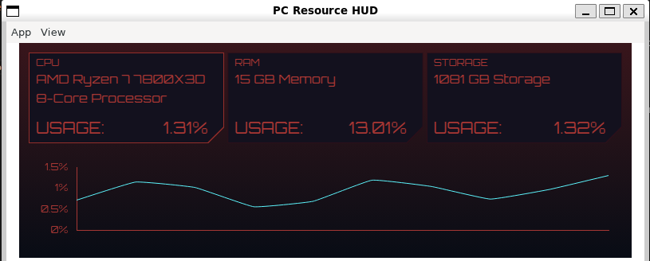

# Electron + Vue.js Computer Resource Desktop Application
Built using the [Electron Typescript React Tutorial](https://www.youtube.com/watch?v=fP-371MN0Ck) from freeCodeCamp.org

Replaced entire front end with the front end integration with Vue.js because I wanted a small challenge and I personally like.

Styled it to look somewhat Cyberpunk-ish

## Screenshot Example

## How to Use
Here's a small step by step on how to use this

## Tool Acknowlegements
### Vue 3 + TypeScript + Vite (This is a )
This template should help get you started developing with Vue 3 and TypeScript in Vite. The template uses Vue 3 `<script setup>` SFCs, check out the [script setup docs](https://v3.vuejs.org/api/sfc-script-setup.html#sfc-script-setup) to learn more.

Learn more about the recommended Project Setup and IDE Support in the [Vue Docs TypeScript Guide](https://vuejs.org/guide/typescript/overview.html#project-setup).

### Vitepress
Utilizes Vitepress for the main site on this.